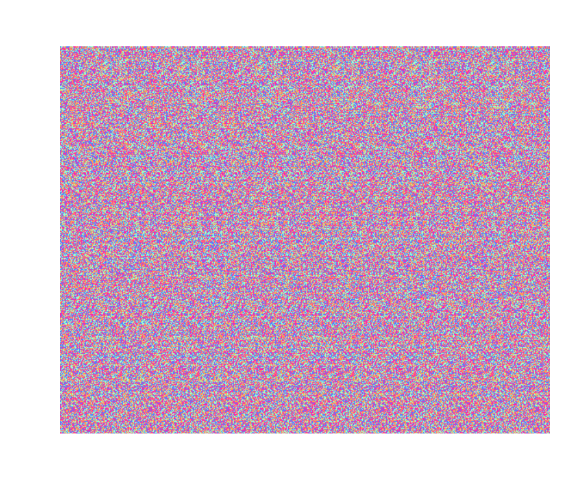

<!-- README.md is generated from README.Rmd. Please edit that file -->

```{r, include = FALSE}
knitr::opts_chunk$set(
  collapse = TRUE,
  comment = "#>",
  fig.path = "man/figures/README-",
  out.width = "100%"
)
```

# MagicEye

Super nascent project to create MagicEye-ish autostereogram based off [this paper](https://www2.cs.sfu.ca/CourseCentral/414/li/material/refs/SIRDS-Computer-94.pdf).

Not yet a package.




